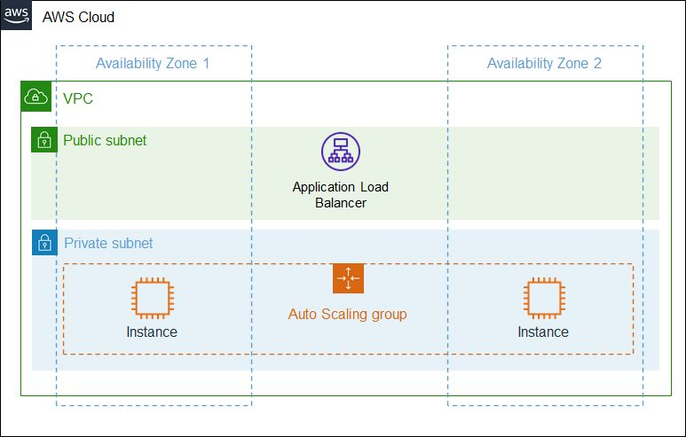

# desafio
Desafio terraform

* Configurações Nível Hard
  - 1 VPC
  - 1 Internet Gateway
  - 2 NatGateway
  - 4 Subnets (2 Públicas 2 Privadas)
  - 3 RouteTable
  - 1 RouteTable - Pública (Apontando para o Internet Gateway)
  - 2 RouteTable - Privadas (Cada uma apontando para um NatGateway)
  - 1 AutoScaling nas Subnets Privadas
  - Security Group com porta 80 liberada
  - 1 Classic/ALB nas subnets Públicas
  - Caso ClassicLB Security Group com porta 80 liberada

